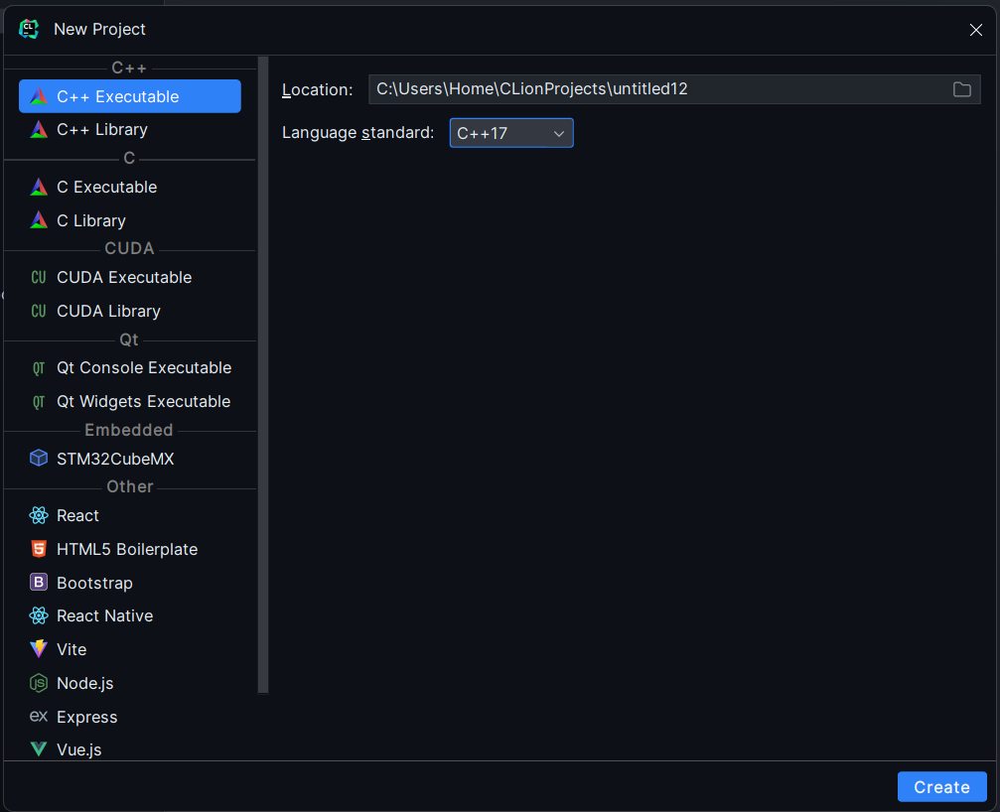

# Laborator 1: Introducere în Mediul de Dezvoltare - CLion, Compilare, Debugging, Makefile, GitHub

## Obiective

1. Familiarizarea cu mediul de dezvoltare CLion.
2. Înțelegerea procesului de compilare și debugging.
3. Crearea și utilizarea unui fișier Makefile pentru automatizarea compilării.
4. Configurarea unui repository GitHub și gestionarea versiunilor de cod.

## 1. Introducere în CLion

CLion este un IDE (Integrated Development Environment) dezvoltat de JetBrains, destinat programării în C/C++.

### Pași de urmat:

1. **Instalare CLion:** Descărcați și instalați CLion de
   pe [site-ul oficial JetBrains](https://www.jetbrains.com/clion/), [ghid de instalare](../assets/Instalare%20Clion%20+%20explicatie%20debugger.pdf).
2. **Primul proiect:**

    - Deschideți CLion și creați un nou proiect C++.

   

    - Selectați „Create New Project” și alegeți „C++ Executable”.

   

## 2. Compilare și Debugging în CLion

Compilarea este procesul de transformare a codului sursă în cod executabil. Debugging-ul este procesul de identificare
și corectare a erorilor din cod.

### Pași de urmat:

1. **Scrierea unui program simplu:** Scrieți un program simplu în `main.cpp` care afișează „Hello, World!”.

```cpp
#include <iostream>

int main() {
    std::cout << "Hello, World!" << std::endl;
    return 0;
}
```

2. **Compilare și rulare:** Apăsați butonul `Build` sau folosiți comanda `Ctrl + F9` pentru a compila programul.

3. **Debugging:** Apăsați butonul `Debug` sau folosiți comanda `Shift + F9` pentru a rula programul în modul de
   debugging.

## 3. Crearea și utilizarea unui Makefile

Un Makefile este un fișier care automatizează procesul de compilare. Este deosebit de util în proiectele mai mari, unde
gestionarea manuală a compilării poate deveni complicată.

### Pași de urmat:

1. **Crearea unui Makefile:**
    - În rădăcina proiectului, creați un fișier nou numit `Makefile`.
    - Adăugați următorul conținut în fișierul `Makefile` pentru a compila programul „Hello, World!”:
      ```makefile
      all: main
 
      main: main.cpp
          g++ -o main main.cpp
 
      clean:
          rm -f main
      ```
      Atenție că folosiți spații, nu tab-uri, pentru a defini regulile în Makefile. 

    - **Explicație:**
        - `all: main` definește regula implicită ce va fi rulată când se execută comanda `make`.
        - `main: main.cpp` specifică faptul că `main.cpp` este necesar pentru a construi ținta `main`.
        - `g++ -o main main.cpp` este comanda de compilare care generează fișierul executabil `main` din
          sursa `main.cpp`.
        - `clean:` definește o regulă pentru a șterge fișierul executabil generat. Aceasta este utilă pentru a curăța
          directorul de fișierele compilate.

2. **Utilizarea Makefile-ului:**
    - **Compilarea programului:** Deschideți terminalul în CLion (`Alt + F12` sau `Ctrl + `) și rulați comanda:

      ```bash
      make
      ```
      Aceasta va compila programul și va genera un fișier executabil numit `main`.

    - **Curățarea fișierelor generate:** Pentru a șterge fișierul executabil `main`, rulați comanda:

      ```bash
      make clean
      ```

### Beneficii ale utilizării unui Makefile:

- **Automatizarea procesului de compilare:** Nu trebuie să rețineți comenzi lungi de compilare; Makefile face asta
  pentru voi.
- **Gestionarea dependențelor:** În proiectele mari, Makefile poate gestiona multiple fișiere sursă și compilarea lor în
  ordine corectă.
- **Portabilitate:** Codul poate fi compilat ușor pe alte mașini fără a necesita configurări suplimentare, atât timp cât
  Makefile-ul este configurat corect.

## Exerciții

1. **Creați o funcție care primește un număr întreg și returnează dublul acestuia. Apelați funcția în `main.cpp` și
   afișați rezultatul.**
2. **Folosiți panoul de debugging pentru a observa valorile variabilelor în timpul rulării programului.**

